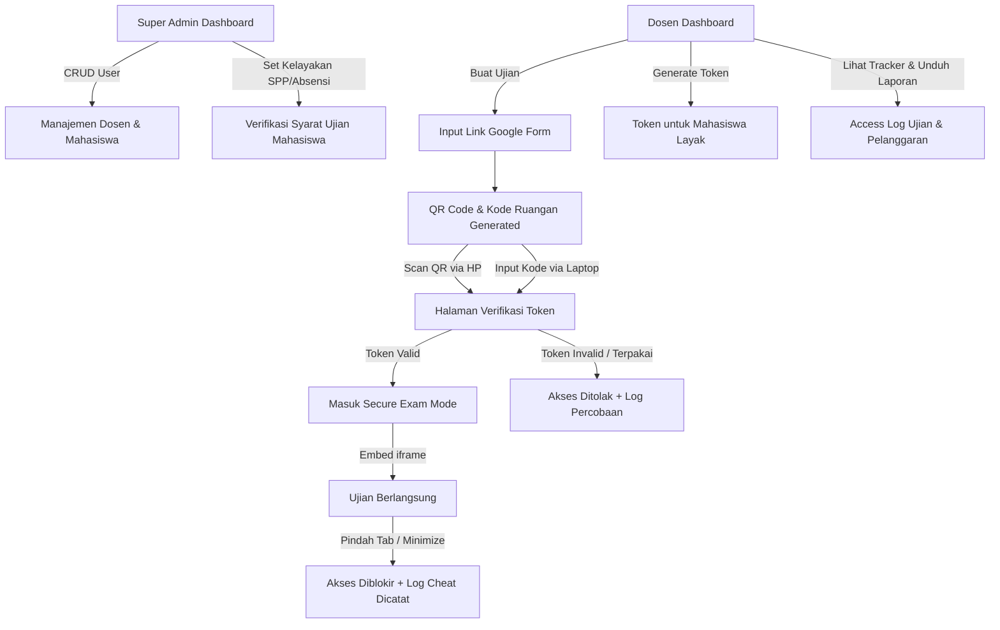

# examRAYA 🛡️ — Portal Verifikasi Ujian & Anti-Cheat System

> **Secure Exam Gatekeeper & Real-Time Tracking Portal**  
> Dirancang khusus untuk **STAI Raden Abdullah Yaqin (STAIRAY)** untuk mengamankan, memvalidasi kelayakan mahasiswa, dan melacak pengerjaan ujian berbasis Google Form.

---

## 📖 Latar Belakang & Masalah

Pada pelaksanaan ujian berbasis online (seperti Google Form), institusi seringkali menghadapi masalah kebocoran link ujian. Link ujian sering dibagikan secara bebas oleh mahasiswa ke grup-grup luar, sehingga diakses secara ilegal oleh mahasiswa yang **belum memenuhi persyaratan administrasi** (misalnya belum melunasi SPP atau persentase kehadiran kurang). Google Form standar tidak memiliki mekanisme validasi individu di luar pembatasan domain email.

**examRAYA** hadir sebagai **"Gatekeeper" (Portal Perantara)** yang kokoh. Mahasiswa wajib memverifikasi diri menggunakan **Token Unik Sekali Pakai** yang di-generate dari sistem sebelum dapat mengakses soal ujian. Soal dimuat langsung di dalam aplikasi melalui *Secure Exam View* yang terproteksi oleh sistem deteksi kecurangan terpadu (*Anti-Cheat*).

---

## 📐 Arsitektur Sistem

Alur kerja fungsionalitas utama **examRAYA** digambarkan melalui diagram berikut:



---

## ✨ Fitur Utama

### 🔑 1. Dasbor Super Admin (Manajemen Pusat)
*   **Manajemen Dosen & Mahasiswa:** Mengelola data dosen dan mahasiswa secara menyeluruh (CRUD terpadu).
*   **Bulk Import Mahasiswa:** Fitur impor data mahasiswa secara cepat melalui file CSV.
*   **Status Kelayakan Ujian Global:** Super Admin memegang kendali penuh untuk menentukan apakah seorang mahasiswa *Eligible* (Layak Ujian) berdasarkan pelunasan SPP atau tingkat absensi kuliah.

### 👨‍🏫 2. Dasbor Dosen (Manajemen Kelas)
*   **Pembuatan Ujian Terkendali:** Menentukan judul ujian, mata kuliah, jadwal waktu mulai-selesai, dan menautkan URL Google Form ujian.
*   **Generasi Token Cerdas:** Dosen dapat men-generate kode token unik (`XXXX-XXXX-XXXX`) secara massal. Sistem secara cerdas membatasi generasi token **hanya untuk mahasiswa yang berstatus Layak Ujian (Eligible)** dari database Super Admin.
*   **Override Akses:** Dosen memiliki otoritas untuk memblokir atau mengizinkan mahasiswa tertentu secara spesifik untuk kelas ujiannya jika ada pengecualian dispensasi mendadak.
*   **Unduh Token & QR Code:** Ekspor daftar token ke CSV dan unduh QR Code beresolusi tinggi dengan cetakan Kode Ruangan di bawahnya untuk ditampilkan di proyektor kelas.

### 📱 3. Akses Ruang Ujian Fleksibel
*   **QR Code Scanner:** Mahasiswa dapat memindai QR Code di ruang ujian menggunakan kamera handphone (didukung oleh pustaka `html5-qrcode` yang responsif).
*   **Kode Ruangan 6 Karakter:** Alternatif cepat bagi mahasiswa yang menggunakan laptop agar langsung terhubung ke halaman verifikasi tanpa memindai.

### 🛡️ 4. Secure Exam Mode & Sistem Proteksi (Anti-Cheat)
*   **Wajib Fullscreen:** Lembar soal Google Form hanya akan memuat jika browser berada dalam mode Fullscreen penuh. Keluar dari fullscreen akan langsung memblokir tampilan ujian.
*   **Focus Tracking (Anti Alt-Tab):** Mendeteksi aksi keluar dari jendela browser, berpindah tab, membuka jendela aplikasi lain, atau meminimalisir layar. Layar soal akan langsung di-blur, akses dikunci sementara, dan aksi dicatat otomatis ke log pelanggaran.
*   **Disable Klik Kanan & Shortcut:** Mematikan fungsi klik kanan (Context Menu) dan kombinasi tombol salin-tempel (`Ctrl+C`, `Ctrl+V`), `Print Screen`, dan tombol developer (`F12`) untuk mencegah penyebaran soal.
*   **Watermark Dinamis:** Overlay transparan yang memuat `NAMA - NIM` mahasiswa di atas lembar soal untuk mencegah kecurangan dalam bentuk pemotretan layar.

### 📊 5. Pelacakan Akses Real-Time & Ekspor Pelanggaran
*   Mencatat secara presisi setiap aktivitas siswa yang meliputi: waktu akses, user-agent, metode masuk, hingga detail pelanggaran (misalnya: *Exit Fullscreen*, *Tab Focus Lost*).
*   Fitur ekspor log aktivitas ujian ke berkas CSV untuk keperluan evaluasi sidang ujian oleh Dosen.

---

## 🛠️ Spesifikasi Teknis (Tech Stack)

| Komponen | Teknologi | Keterangan |
|----------|-----------|------------|
| **Core UI** | Vanilla HTML5 & CSS3 | Tampilan premium dengan gaya *Glassmorphism* modern dan gelap (*Dark Mode*). |
| **Routing** | Vanilla JS SPA (Hash-based) | Navigasi halaman cepat tanpa reload/refresh browser. |
| **QR Code** | `html5-qrcode` & `qrcodejs` | Mendukung pembuatan QR Code dinamis dan scan real-time lewat kamera. |
| **Kriptografi** | CryptoJS (SHA-256) | Mengamankan data token, validasi, dan status keabsahan di sisi klien. |
| **Icons & Font** | Lucide Icons & Google Fonts | Font *Inter* modern yang sangat terbaca dan ikon SVG tajam. |
| **Storage Layer**| `safeStorage` Wrapper (Custom) | Wrapper cerdas buatan kami yang mendeteksi ketersediaan `localStorage` dan otomatis beralih ke *In-Memory fallback* jika diblokir oleh browser. |

---

## 🔒 Teknologi Unggulan: `safeStorage` Fallback System

Salah satu tantangan terbesar saat meluncurkan aplikasi web statis langsung dari media penyimpanan lokal (protokol `file:///`) adalah kebijakan keamanan browser modern yang memblokir akses ke `localStorage`. Hal ini biasanya menyebabkan aplikasi langsung memicu eror layar hitam total.

**examRAYA** menyelesaikan isu ini dengan menghadirkan **`safeStorage`**:
```javascript
// js/utils.js
window.safeStorage = {
    // Otomatis menguji ketersediaan localStorage,
    // jika diblokir keamanan browser, beralih ke RAM Object Store secara transparan.
};
```
Berkat modul ini, **examRAYA** dijamin **100% stabil** dijalankan dari server web online (HTTPS) maupun saat dibuka langsung dengan klik ganda (*double click*) file `index.html` dari folder lokal/Google Drive tanpa memerlukan instalasi server apa pun!

---

## 📂 Struktur Direktori Proyek

```
examraya/
├── index.html                  # Entry point utama & container SPA
├── prd.md                      # Product Requirement Document
├── devlog.md                   # Catatan log historis rilis fitur
├── implementation_plan.md      # Rencana desain & alur awal
├── css/
│   └── style.css               # Desain Glassmorphism & Token UI
├── .github/
│   └── workflows/
│       └── deploy.yml          # Otomatisasi pendeployan GitHub Pages via Actions
└── js/
    ├── app.js                  # Engine router, penanganan login & view templates
    ├── superadmin.js           # Pengelolaan User Dosen, Mahasiswa, & Status SPP
    ├── dosen.js                # Pengelolaan Ujian, Tracker Kelas, & Ekspor CSV
    ├── token.js                # Logika token generator & enkripsi SHA-256
    ├── tracker.js              # Log pencatat aktivitas & cheat detector
    ├── exam.js                 # Lembar Secure Exam View (Iframe, Fullscreen & Anti-Cheat)
    └── utils.js                # Enkripsi CryptoJS, safeStorage, & format tanggal
```

---

## 💻 Panduan Menjalankan Secara Lokal

1. Unduh atau klon repositori ini:
   ```bash
   git clone https://github.com/lightnet19/examraya.git
   ```
2. Buka direktori proyek:
   ```bash
   cd examraya
   ```
3. Klik ganda file **`index.html`** untuk langsung membukanya di browser favorit Anda! (Tidak memerlukan Node.js atau Apache/XAMPP).

---

## 🚀 Panduan Deployment (Online)

### Opsi 1: Otomatis Menggunakan GitHub Pages (Terintegrasi)
Kami telah menyematkan berkas alur kerja **GitHub Actions** (`deploy.yml`). Aplikasi Anda akan langsung aktif secara publik hanya dalam 3 langkah mudah:
1. Masuk ke halaman repositori Anda di GitHub.
2. Klik tab **Settings** -> **Pages** (di menu sebelah kiri).
3. Pada bagian **Build and deployment** -> **Source**, ubah opsi pilihan dari *"Deploy from a branch"* menjadi **"GitHub Actions"**.

*Selesai!* GitHub akan menjalankan proses deployment secara otomatis. Halaman ujian Anda akan aktif di:
🌐 **`https://lightnet19.github.io/examraya/`**

### Opsi 2: Menggunakan Vercel
1. Buka dasbor **Vercel** Anda.
2. Klik tombol **Add New** -> **Project**.
3. Sambungkan ke GitHub Anda, cari repositori **`examraya`**, lalu klik **Import**.
4. Klik **Deploy** (Tanpa perlu mengubah konfigurasi build karena ini adalah aplikasi statis murni).
5. Vercel akan memberikan domain online yang siap dibagikan ke dosen dan mahasiswa dalam hitungan detik!

---

## 🏛️ Kredensial Default Uji Coba

Untuk keperluan demonstrasi awal, Anda dapat masuk menggunakan akun default berikut:

*   **Super Admin:**
    *   *Username:* `admin`
    *   *Password:* `admin123`
*   **Dosen:**
    *   *Username:* `dosen` (Dapat ditambah melalui dasbor Super Admin menggunakan **NIDN / NUPTK**)
    *   *Password:* `dosen123`

---

> Dibuat dengan penuh dedikasi untuk menjaga integritas akademik di **STAI Raden Abdullah Yaqin**. 🛡️🎓
