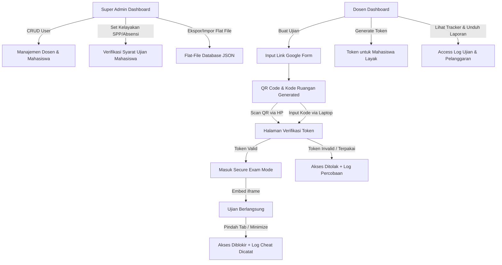

# examRAYA 🛡️ — Portal Verifikasi Ujian & Anti-Cheat System

> **Secure Exam Gatekeeper & Real-Time Tracking Portal**  
> Dirancang khusus untuk **STAI Raden Abdullah Yaqin (STAIRAY)** untuk mengamankan, memvalidasi kelayakan mahasiswa, dan melacak pengerjaan ujian berbasis Google Form.

---

## 📖 Latar Belakang & Masalah

Pada pelaksanaan ujian berbasis online (seperti Google Form), institusi seringkali menghadapi masalah kebocoran link ujian. Link ujian sering dibagikan secara bebas oleh mahasiswa ke grup-grup luar, sehingga diakses secara ilegal oleh mahasiswa yang **belum memenuhi persyaratan administrasi** (misalnya belum melunasi SPP atau persentase kehadiran kurang). Google Form standar tidak memiliki mekanisme validasi individu di luar pembatasan domain email.

**examRAYA** hadir sebagai **"Gatekeeper" (Portal Perantara)** yang kokoh. Mahasiswa wajib memverifikasi diri menggunakan **Token Unik Sekali Pakai** yang di-generate dari sistem sebelum dapat mengakses soal ujian. Soal dimuat langsung di dalam aplikasi melalui *Secure Exam View* yang terproteksi oleh sistem deteksi kecurangan terpadu (*Anti-Cheat*).

---

## 📐 Arsitektur Sistem

Alur kerja fungsionalitas utama **examRAYA** digambarkan melalui diagram berikut:



---

## ✨ Fitur Utama

### 🎨 1. Premium Cyber Dark Glassmorphism UI (Google Stitch)
*   **Desain Modern & Responsif**: Antarmuka kelas atas yang megah dengan tema gelap, perpaduan HSL *curated color palettes*, efek kaca transparan (*glassmorphism*), tombol gradien neon, dan mikro-animasi halus untuk memberikan pengalaman pengguna yang sangat premium.
*   **Geometric Typography**: Memuat tipografi geometric modern `Plus Jakarta Sans` dari Google Fonts untuk memaksimalkan keterbacaan di semua jenis perangkat.
*   **Tata Letak Pintar**: Pemanfaatan *responsive grid*, sistem pemberitahuan *toast* dinamis, dan popup kode QR lebar interaktif dengan dukungan unduh cetak instan.

### 🔑 2. Dasbor Super Admin (Manajemen Pusat)
*   **Manajemen Dosen & Mahasiswa**: Mengelola akun dosen (NIDN/Username) dan identitas mahasiswa secara terpusat (CRUD terpadu).
*   **Status Kelayakan Ujian**: Penanda kelayakan (*Layak* atau *Diblokir*) berdasarkan SPP/Absensi dengan warna status kontras yang mempermudah identifikasi cepat.
*   **Flat-File Database Manager**: Layanan ekspor-impor mandiri berbasis berkas flat JSON lokal (selengkapnya pada poin 6).

### 👨‍🏫 3. Dasbor Dosen (Manajemen Kelas)
*   **Pembuatan Ujian Terkendali**: Membuat ujian baru, menyematkan URL Google Form, dan otomatis memproduksi Kode Ruangan 6-karakter acak.
*   **Token & QR Code Generator**: Memproduksi token ujian sekali pakai (`XXXX-XXXX-XXXX`) secara otomatis untuk mahasiswa berstatus Layak. Dilengkapi opsi unduhan lembar QR Code beresolusi tinggi.
*   **Reset & Manajemen Sesi**: Mengawasi sesi ujian aktif, mematikan token yang telah terpakai, dan mereset status token jika terjadi kendala teknis pada mahasiswa.

### 🛡️ 4. Secure Exam Mode & Anti-Cheat System (Diperketat)
*   **Watermark KTM Diagonal Berulang**: Lapisan watermark transparan berulang (`NAMA - NIM`) di atas iframe lembar soal untuk meminimalisir niat mendistribusikan soal lewat kamera ponsel.
*   **Enforcement Layar Penuh (Fullscreen)**: Mewajibkan browser berada pada mode layar penuh. Deteksi menonaktifkan layar penuh akan langsung mengunci soal ujian.
*   **Focus & Visibility Tracking**: Melacak pembukaan tab baru, minimize browser, atau hilangnya fokus jendela. Soal akan langsung diselimuti lapisan blur buram merah menyala bertuliskan **"PELANGGARAN TERDETEKSI"** dan akses dikunci sementara hingga diizinkan kembali oleh pengawas.
*   **Blokir Klik Kanan & Shortcut**: Memblokir menu klik kanan (`contextmenu`) serta mematikan salin-tempel dan pintasan developer untuk menyulitkan inspeksi kode.

### 📊 5. Real-Time Security Monitor & Ekspor Laporan
*   **Monitoring Live**: Dosen dapat memantau secara langsung histori aktivitas mahasiswa mulai dari waktu mulai, selesai, hingga setiap insiden kecurangan secara real-time.
*   **Ekspor Pelanggaran**: Mengunduh seluruh log pelanggaran terfilter ke format flat CSV untuk evaluasi sidang akademik pasca-ujian.

### 🗂️ 6. Flat-File Database Management (Backup & Restore)
*   **Mandiri Tanpa Cloud**: Menggunakan `safeStorage` (in-memory & localStorage wrapper) yang memungkinkannya berjalan tanpa ketergantungan database online (Supabase/Firebase) saat fase prototype.
*   **Ekspor Database (JSON Flat File)**: Fitur mencadangkan seluruh isi sistem (mahasiswa, dosen, ujian, token, dan log keamanan) ke dalam satu file flat `.json` lokal.
*   **Restorasi Database (JSON Flat File)**: Memulihkan database secara instan di komputer/browser penguji mana pun cukup dengan mengunggah kembali file cadangan `.json`.
*   **Pintasan Reset Demo**: Tombol pintas untuk memulihkan database tiruan standar secara instan demi kenyamanan presentasi prototype.

---

## 🛠️ Spesifikasi Teknis (Tech Stack)

| Komponen | Teknologi | Keterangan |
|----------|-----------|------------|
| **Core UI** | Vanilla HTML5 & CSS3 | Tema *Cyber Dark Glassmorphic* premium yang diselaraskan dengan standar *Google Stitch*. |
| **Routing** | Vanilla JS SPA (Hash-based) | Navigasi SPA cepat, responsif, dan bebas refresh browser. |
| **QR Code** | `html5-qrcode` & `qrcodejs` | Generator kode QR instan dan pemindai kamera real-time berlatar kaca dinamis. |
| **Kriptografi** | CryptoJS (SHA-256) | Mengamankan data token, otentikasi login, dan integritas hash di sisi klien. |
| **Icons & Font** | Lucide Icons & Google Fonts | Tipografi geometris *Plus Jakarta Sans* dan ikon SVG *lightweight* responsif. |
| **Storage Layer**| `safeStorage` Wrapper (Custom) | Wrapper cerdas yang mendeteksi ketersediaan `localStorage` dan otomatis beralih ke *In-Memory fallback* secara transparan bila dijalankan langsung dari folder lokal (`file:///`). |

---

## 📂 Struktur Direktori Proyek

```
examraya/
├── index.html                  # Entry point utama & container SPA
├── prd.md                      # Product Requirement Document
├── devlog.md                   # Catatan log historis rilis fitur
├── implementation_plan.md      # Rencana desain & alur awal
├── css/
│   └── style.css               # Desain Glassmorphism Premium, Grid & Custom Styles
├── .github/
│   └── workflows/
│       └── deploy.yml          # Otomatisasi pendeployan GitHub Pages via Actions
└── js/
    ├── app.js                  # Engine router, penanganan login & view templates
    ├── superadmin.js           # Pengelolaan User Dosen, Mahasiswa, & Flat-File Database (JSON)
    ├── dosen.js                # Pengelolaan Ujian, Tracker Kelas, QR Code Modal & Ekspor CSV
    ├── token.js                # Logika token generator & enkripsi SHA-256
    ├── tracker.js              # Log pencatat aktivitas & cheat detector
    ├── exam.js                 # Lembar Secure Exam View (Iframe, Watermark KTM, & Anti-Cheat)
    └── utils.js                # Enkripsi CryptoJS, safeStorage, format tanggal, & Data Seed Demo
```

---

## 💻 Panduan Menjalankan Secara Lokal

1. Unduh atau klon repositori ini:
   ```bash
   git clone https://github.com/lightnet19/examraya.git
   ```
2. Buka direktori proyek:
   ```bash
   cd examraya
   ```
3. Klik ganda file **`index.html`** untuk langsung membukanya di browser favorit Anda! (Tidak memerlukan Node.js atau Apache/XAMPP).

---

## 🚀 Panduan Deployment (Online)

### Opsi 1: Otomatis Menggunakan GitHub Pages (Terintegrasi)
Kami telah menyematkan alur kerja **GitHub Actions** (`deploy.yml`). Aplikasi Anda akan langsung aktif secara publik hanya dalam 3 langkah mudah:
1. Masuk ke halaman repositori Anda di GitHub.
2. Klik tab **Settings** -> **Pages** (di menu sebelah kiri).
3. Pada bagian **Build and deployment** -> **Source**, ubah opsi pilihan dari *"Deploy from a branch"* menjadi **"GitHub Actions"**.

*Selesai!* GitHub akan menjalankan proses deployment secara otomatis. Halaman ujian Anda akan aktif di:
🌐 **`https://lightnet19.github.io/examraya/`**

### Opsi 2: Menggunakan Vercel
1. Buka dasbor **Vercel** Anda.
2. Klik tombol **Add New** -> **Project**.
3. Sambungkan ke GitHub Anda, cari repositori **`examraya`**, lalu klik **Import**.
4. Klik **Deploy** (Tanpa perlu mengubah konfigurasi build karena ini adalah aplikasi statis murni).
5. Vercel akan memberikan domain online yang siap dibagikan ke dosen dan mahasiswa dalam hitungan detik!

---

## 🏛️ Kredensial Default Uji Coba (Auto-Seeded Prototype)

Aplikasi ini dilengkapi dengan **Auto-Seeding Engine** saat pertama kali dimuat. Anda dapat langsung menguji fungsionalitas multi-peran menggunakan akun dan data tiruan berikut:

### 🔑 Akun Login Pengguna
*   **Super Admin:**
    *   *Username:* `admin`
    *   *Password:* `admin123`
*   **Akun Dosen 1:**
    *   *Username / NIDN:* `dosen1`
    *   *Password:* `dosen123`
    *   *Nama:* `Dr. Ahmad Yani, M.Pd.`
*   **Akun Dosen 2:**
    *   *Username / NIDN:* `dosen2`
    *   *Password:* `dosen123`
    *   *Nama:* `Siti Aminah, M.Sc.`

### 🎓 Contoh Data Mahasiswa (Untuk Validasi)
*   **NIM Layak Ujian (Eligible):**
    *   `2026001` (Budi Santoso — Teknik Informatika)
    *   `2026002` (Dewi Lestari — Sistem Informasi)
*   **NIM Terblokir Ujian (Tidak Layak - Simulasi Keuangan/Absensi):**
    *   `2026003` (Fahri Hamzah — Pendidikan Agama Islam)

### 🏫 Kode Ruang Ujian Pra-Dibuat
*   `MTK101` — UTS Matematika Diskrit (Pengampu: Dr. Ahmad Yani, M.Pd.)
*   `IND202` — UAS Bahasa Indonesia (Pengampu: Siti Aminah, M.Sc.)

---

> Dibuat dengan penuh dedikasi untuk menjaga integritas akademik di **STAI Raden Abdullah Yaqin**. 🛡️🎓
